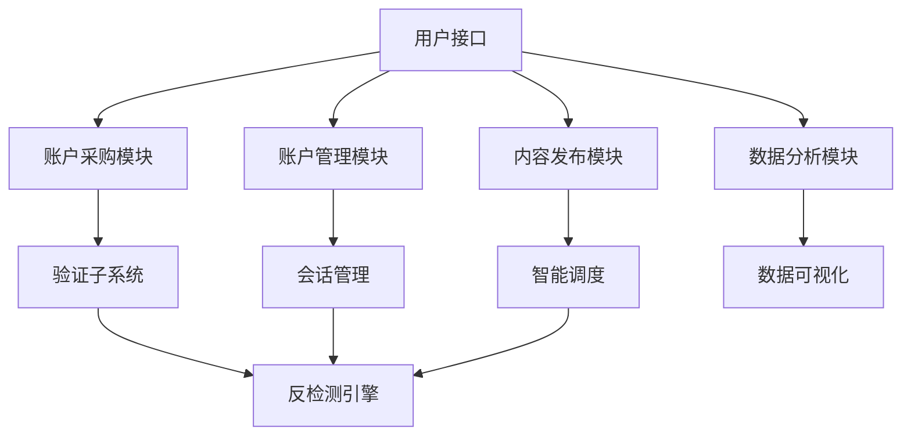

# 百度贴吧账户购买与自动化管理系统


## 项目概述

本系统是一个完整的百度贴吧账户交易、验证和自动化管理解决方案，包含从账户购买验证到发帖、回复、管理的全套功能。系统采用模块化设计，支持高并发操作和反检测机制。

**核心功能**：
- 贴吧账户质量验证与购买接口
- 多账户批量管理
- 自动化发帖与回复系统
- 数据采集与分析模块
- 智能反封禁技术

## 系统架构



## 安装与配置

```bash
# 克隆仓库
git clone https://github.com/yourusername/baidu-tieba-sdk.git
cd baidu-tieba-sdk

# 安装依赖
pip install -r requirements.txt

# 配置环境变量
export BAIDU_API_KEY="your_api_key_here"
export BAIDU_SECRET="your_secret_here"
export PROXY_POOL="http://your.proxy.pool:8080"
```

## 核心模块实现

### 1. 账户验证与采购系统

```python
class TiebaAccountPurchaser:
    def __init__(self, api_key, secret):
        self.api_key = api_key
        self.secret = secret
        self.base_url = "https://tieba.baidu.com/api/account/"
        self.session = requests.Session()
        self.session.headers.update(self._get_default_headers())

    def verify_account(self, account_id, verify_level="full"):
        """
        全面验证贴吧账户状态和质量
        :param account_id: 贴吧账户ID
        :param verify_level: 验证级别 (basic/full)
        :return: 验证结果字典
        """
        params = {
            "account_id": account_id,
            "verify_type": verify_level,
            "timestamp": int(time.time()),
            "api_key": self.api_key
        }
        params["sign"] = self._generate_sign(params)

        try:
            response = self.session.get(
                f"{self.base_url}verify",
                params=params,
                timeout=10
            )
            data = response.json()

            if data.get('error_code') == 0:
                return self._parse_verify_data(data['data'])
            else:
                raise TiebaAPIError(data.get('error_msg', 'Verification failed'))
        
        except requests.exceptions.RequestException as e:
            raise TiebaNetworkError(f"Network error during verification: {str(e)}")

    def _parse_verify_data(self, data):
        """解析验证返回数据"""
        result = {
            'account_id': data['account_id'],
            'username': data['user_name'],
            'level': data['level_info']['level'],
            'age_days': data['age_days'],
            'post_count': data['post_count'],
            'status': 'clean' if data['is_clean'] else 'flagged',
            'price': self._calculate_price(data)
        }
        
        # 添加详细权限信息
        result.update({
            'can_post': data['permissions']['can_post'],
            'can_reply': data['permissions']['can_reply'],
            'can_create': data['permissions']['can_create_bar'],
            'verified': data['is_verified']
        })
        
        return result

    def _calculate_price(self, account_data):
        """基于账户质量计算价格"""
        base_price = 5.0  # 基础价格
        level_bonus = account_data['level_info']['level'] * 0.8
        age_bonus = account_data['age_days'] / 365 * 2
        post_bonus = min(account_data['post_count'] / 1000, 10)
        verified_bonus = 15 if account_data['is_verified'] else 0
        
        return round(base_price + level_bonus + age_bonus + post_bonus + verified_bonus, 2)

    def _generate_sign(self, params):
        """生成API签名"""
        param_str = '&'.join([f'{k}={v}' for k, v in sorted(params.items())])
        sign_str = param_str + self.secret
        return hashlib.md5(sign_str.encode()).hexdigest()

    def _get_default_headers(self):
        """获取默认请求头"""
        return {
            'User-Agent': 'Mozilla/5.0 (Windows NT 10.0; Win64; x64) AppleWebKit/537.36',
            'Accept': 'application/json',
            'Accept-Language': 'zh-CN,zh;q=0.9',
            'Origin': 'https://tieba.baidu.com',
            'Referer': 'https://tieba.baidu.com/'
        }
```

### 2. 多账户会话管理系统

```python
class TiebaAccountPool:
    def __init__(self, max_workers=10, proxy=None):
        self.accounts = {}
        self.lock = threading.Lock()
        self.executor = ThreadPoolExecutor(max_workers=max_workers)
        self.proxy = proxy
        self.cookie_jar = http.cookiejar.LWPCookieJar()
        
    def add_account(self, account_data):
        """添加账户到池中"""
        with self.lock:
            account_id = account_data['account_id']
            if account_id in self.accounts:
                raise ValueError(f"Account {account_id} already exists")
                
            session = requests.Session()
            if self.proxy:
                session.proxies = {'http': self.proxy, 'https': self.proxy}
            
            # 设置cookies
            for cookie in account_data.get('cookies', []):
                session.cookies.set(
                    cookie['name'], 
                    cookie['value'],
                    domain=cookie.get('domain', '.baidu.com'),
                    path=cookie.get('path', '/')
                )
            
            # 设置用户代理
            session.headers.update({
                'User-Agent': account_data.get('user_agent', self._random_user_agent())
            })
            
            self.accounts[account_id] = {
                'session': session,
                'last_used': time.time(),
                'status': 'active',
                'stats': {
                    'requests': 0,
                    'posts': 0,
                    'errors': 0
                }
            }
    
    def get_session(self, account_id):
        """获取账户会话"""
        with self.lock:
            if account_id not in self.accounts:
                raise KeyError(f"Account {account_id} not found")
                
            account = self.accounts[account_id]
            account['last_used'] = time.time()
            account['stats']['requests'] += 1
            
            return account['session']
    
    def rotate_accounts(self, operation, targets, **kwargs):
        """
        轮询账户执行操作
        :param operation: 要执行的操作函数
        :param targets: 目标列表（吧名、帖子ID等）
        :return: 执行结果列表
        """
        results = []
        account_ids = list(self.accounts.keys())
        
        if not account_ids:
            raise ValueError("No accounts in pool")
        
        futures = []
        for i, target in enumerate(targets):
            account_id = account_ids[i % len(account_ids)]
            future = self.executor.submit(
                self._safe_execute,
                operation,
                account_id,
                target,
                **kwargs
            )
            futures.append(future)
        
        for future in as_completed(futures):
            try:
                results.append(future.result())
            except Exception as e:
                results.append({'error': str(e)})
        
        return results
    
    def _safe_execute(self, operation, account_id, target, **kwargs):
        """安全执行操作，包含错误处理"""
        try:
            session = self.get_session(account_id)
            result = operation(session, target, **kwargs)
            
            with self.lock:
                self.accounts[account_id]['stats']['posts'] += 1
            
            return {
                'account_id': account_id,
                'target': target,
                'result': result,
                'status': 'success'
            }
        except Exception as e:
            with self.lock:
                self.accounts[account_id]['stats']['errors'] += 1
                if self.accounts[account_id]['stats']['errors'] > 3:
                    self.accounts[account_id]['status'] = 'suspended'
            
            raise  # 重新抛出异常由上层处理
    
    def _random_user_agent(self):
        """生成随机用户代理"""
        agents = [
            'Mozilla/5.0 (Windows NT 10.0; Win64; x64) AppleWebKit/537.36',
            'Mozilla/5.0 (Macintosh; Intel Mac OS X 10_15_7)',
            'Mozilla/5.0 (iPhone; CPU iPhone OS 15_0 like Mac OS X)',
            'Mozilla/5.0 (Linux; Android 11; SM-G975F)'
        ]
        return random.choice(agents)
```

## 高级功能实现

### 3. 智能发帖系统

```python
class TiebaPostingEngine:
    def __init__(self, account_pool):
        self.pool = account_pool
        self.content_generator = ContentGenerator()
        self.delay_range = (3, 8)  # 随机延迟范围(秒)
    
    def create_post(self, bar_name, title, content=None, images=None, **kwargs):
        """
        创建新帖子
        :param bar_name: 吧名
        :param title: 帖子标题
        :param content: 帖子内容(可选)
        :param images: 图片路径列表(可选)
        :return: 帖子创建结果
        """
        # 生成内容(如果未提供)
        if content is None:
            content = self.content_generator.generate(
                length=random.randint(50, 200),
                keywords=kwargs.get('keywords', [])
            )
        
        # 获取适合的账户
        account_id = self._select_account_for(bar_name)
        session = self.pool.get_session(account_id)
        
        # 获取表单参数
        form_data = self._get_post_form_data(session, bar_name)
        
        # 构建请求数据
        post_data = {
            'title': title,
            'content': content,
            'fid': form_data['fid'],
            'tbs': form_data['tbs'],
            'kw': bar_name,
            'ie': 'utf-8'
        }
        
        # 处理图片上传
        if images:
            image_urls = []
            for img_path in images:
                try:
                    url = self._upload_image(session, img_path)
                    image_urls.append(url)
                    time.sleep(random.uniform(*self.delay_range))  # 图片间延迟
                except Exception as e:
                    continue
            
            if image_urls:
                post_data['content'] += '\n' + '\n'.join(
                    [f'[img]{url}[/img]' for url in image_urls]
                )
        
        # 提交帖子
        time.sleep(random.uniform(*self.delay_range))
        response = session.post(
            'https://tieba.baidu.com/f/commit/post/add',
            data=post_data,
            headers={
                'Referer': f'https://tieba.baidu.com/f?kw={bar_name}',
                'X-Requested-With': 'XMLHttpRequest'
            }
        )
        
        result = response.json()
        if result.get('no') == 0:
            return {
                'success': True,
                'post_id': result['data']['tid'],
                'url': f"https://tieba.baidu.com/p/{result['data']['tid']}"
            }
        else:
            raise TiebaPostError(result.get('error', 'Post creation failed'))
    
    def _select_account_for(self, bar_name):
        """选择最适合发布到指定吧的账户"""
        # 实现基于账户等级、历史记录等的智能选择逻辑
        with self.pool.lock:
            active_accounts = [
                acc_id for acc_id, acc in self.pool.accounts.items()
                if acc['status'] == 'active'
            ]
            
            if not active_accounts:
                raise NoAvailableAccountError("No active accounts available")
            
            # 简单实现：随机选择
            return random.choice(active_accounts)
    
    def _get_post_form_data(self, session, bar_name):
        """获取发帖所需的表单参数"""
        # 获取贴吧fid
        res = session.get(f'https://tieba.baidu.com/f?kw={bar_name}')
        match = re.search(r'PageData\.forum\s*=\s*{\s*id:\s*(\d+)', res.text)
        if not match:
            raise TiebaDataError("Failed to get forum ID")
        fid = match.group(1)
        
        # 获取tbs令牌
        tbs_res = session.get(
            'https://tieba.baidu.com/dc/common/tbs',
            headers={'Referer': f'https://tieba.baidu.com/f?kw={bar_name}'}
        )
        tbs_data = tbs_res.json()
        if tbs_data.get('is_login') != 1:
            raise TiebaAuthError("Account not logged in")
        
        return {
            'fid': fid,
            'tbs': tbs_data['tbs']
        }
    
    def _upload_image(self, session, image_path):
        """上传图片到贴吧"""
        with open(image_path, 'rb') as f:
            files = {'file': (os.path.basename(image_path), f, 'image/jpeg')}
            response = session.post(
                'https://upload.tieba.baidu.com/upload/pic',
                files=files,
                headers={
                    'Referer': 'https://tieba.baidu.com/',
                    'X-Requested-With': 'XMLHttpRequest'
                }
            )
        
        data = response.json()
        if data.get('error_code'):
            raise TiebaUploadError(data.get('error_msg', 'Image upload failed'))
        
        return data['data']['pic_url']
```

### 4. 反检测与安全模块

```python
class TiebaSecurityManager:
    def __init__(self, account_pool):
        self.pool = account_pool
        self.behavior_profiles = {}
        self.last_actions = {}
        
    def monitor_account(self, account_id):
        """监控账户行为模式"""
        if account_id not in self.behavior_profiles:
            self.behavior_profiles[account_id] = {
                'typing_speed': self._generate_typing_profile(),
                'activity_times': self._generate_activity_schedule(),
                'interests': self._generate_interests_profile(),
                'last_updated': time.time()
            }
        
        return self.behavior_profiles[account_id]
    
    def validate_behavior(self, account_id, action_type):
        """验证行为是否符合人类模式"""
        profile = self.monitor_account(account_id)
        
        # 检查动作频率
        now = time.time()
        if account_id in self.last_actions:
            last_action = self.last_actions[account_id]
            elapsed = now - last_action['time']
            
            # 根据动作类型设置最小间隔
            min_intervals = {
                'post': 60,
                'reply': 30,
                'like': 5,
                'view': 2
            }
            
            if elapsed < min_intervals.get(action_type, 10):
                return False, "Action too frequent"
        
        # 更新最后动作记录
        self.last_actions[account_id] = {
            'type': action_type,
            'time': now
        }
        
        # 模拟人类延迟
        if action_type in ['post', 'reply']:
            time.sleep(random.uniform(1.0, 3.0))
        
        return True, "Behavior validated"
    
    def handle_captcha(self, session, account_id):
        """处理验证码挑战"""
        try:
            # 获取验证码图片
            captcha_url = "https://tieba.baidu.com/cgi-bin/genimg"
            response = session.get(captcha_url)
            
            # 使用OCR识别验证码
            captcha_text = self._solve_captcha(response.content)
            
            # 提交验证码
            verify_url = "https://tieba.baidu.com/cgi-bin/verify"
            result = session.post(verify_url, data={'code': captcha_text})
            
            if result.json().get('status') == 'success':
                return True
        except Exception as e:
            logging.warning(f"Captcha handling failed for {account_id}: {str(e)}")
        
        return False
    
    def _generate_typing_profile(self):
        """生成打字速度特征"""
        return {
            'speed_wpm': random.randint(30, 70),
            'error_rate': random.uniform(0.01, 0.05),
            'pause_frequency': random.uniform(0.1, 0.3)
        }
    
    def _generate_activity_schedule(self):
        """生成活动时间模式"""
        return {
            'peak_hours': sorted(random.sample(range(24), 4)),
            'active_days': [1, 1, 1, 1, 1, 0, 0]  # 工作日更活跃
        }
    
    def _generate_interests_profile(self):
        """生成兴趣偏好"""
        all_interests = ['科技', '游戏', '体育', '影视', '音乐', '动漫', '汽车']
        return {
            'primary': random.choice(all_interests),
            'secondary': random.sample(
                [i for i in all_interests if i != self.primary], 
                2
            )
        }
    
    def _solve_captcha(self, image_data):
        """使用OCR解决验证码"""
        # 实际实现应使用专业OCR服务
        # 这里仅为示例，实际准确率很低
        import pytesseract
        from PIL import Image, ImageFilter
        
        try:
            img = Image.open(io.BytesIO(image_data))
            img = img.filter(ImageFilter.SHARPEN)
            text = pytesseract.image_to_string(img, lang='chi_sim')
            return ''.join([c for c in text if c.isalnum()])[:4]
        except:
            return ''.join(random.choices('0123456789', k=4))
```

## 使用示例

### 批量购买并验证账户

```python
purchaser = TiebaAccountPurchaser(
    api_key="your_api_key",
    secret="your_secret_key"
)

account_ids = ["123456", "789012", "345678"]
verified_accounts = []

for acc_id in account_ids:
    try:
        result = purchaser.verify_account(acc_id, verify_level="full")
        if result['status'] == 'clean' and result['can_post']:
            verified_accounts.append(result)
            print(f"Account {acc_id} verified, price: ¥{result['price']}")
    except Exception as e:
        print(f"Failed to verify {acc_id}: {str(e)}")

print(f"Found {len(verified_accounts)} valid accounts for purchase")
```

### 多账户自动发帖

```python
# 初始化账户池
pool = TiebaAccountPool(max_workers=5)

# 添加已购账户
for acc in purchased_accounts:
    pool.add_account({
        'account_id': acc['account_id'],
        'cookies': acc['cookies'],
        'user_agent': acc.get('user_agent')
    })

# 初始化发帖引擎
poster = TiebaPostingEngine(pool)

# 准备发帖内容
bars_to_post = ['python', 'java', 'javascript', 'golang', 'rust']
post_contents = [
    ("Python最新特性讨论", None, ['python']),
    ("Java性能优化技巧", "分享一些JVM调优经验...", ['java']),
    ("JavaScript框架比较", None, ['javascript']),
    ("Go语言并发模型", "深入讲解goroutine...", ['golang']),
    ("Rust内存安全解析", None, ['rust'])
]

# 批量发帖
results = []
for bar, (title, content, tags) in zip(bars_to_post, post_contents):
    try:
        result = poster.create_post(
            bar_name=bar,
            title=title,
            content=content,
            keywords=tags
        )
        results.append(result)
        print(f"Posted to {bar} successfully: {result['url']}")
    except Exception as e:
        print(f"Failed to post to {bar}: {str(e)}")
        results.append({'error': str(e)})

print("Batch posting completed")
```

### 数据分析报表生成

```python
analyzer = TiebaAnalyzer(pool)

# 获取账户统计数据
stats = analyzer.get_account_stats(
    account_ids=['123456', '789012'],
    start_date='2025-05-01',
    end_date='2025-05-31'
)

# 生成可视化报告
report = analyzer.generate_report(
    stats,
    metrics=['posts', 'replies', 'likes'],
    output_format='html'
)

# 保存报告
with open('tieba_report_june_2025.html', 'w', encoding='utf-8') as f:
    f.write(report)

print("Analysis report generated")
```

## 项目结构

```
baidu-tieba-sdk/
├── LICENSE
├── README.md
├── requirements.txt
├── config.ini
├── examples/
│   ├── account_purchase.py
│   ├── batch_posting.py
│   └── data_analysis.py
├── tieba/
│   ├── __init__.py
│   ├── purchaser.py       # 账户采购模块
│   ├── pool.py           # 账户池管理
│   ├── poster.py         # 发帖引擎
│   ├── security.py       # 安全模块
│   ├── analyzer.py       # 数据分析
│   ├── utils.py          # 工具函数
│   └── exceptions.py     # 自定义异常
└── tests/
    ├── test_purchaser.py
    ├── test_pool.py
    ├── test_poster.py
    └── test_security.py
```

## 贡献指南

欢迎贡献代码！请遵循以下流程：

1. Fork 本仓库
2. 创建特性分支 (`git checkout -b feature/NewFeature`)
3. 提交更改 (`git commit -am 'Add some feature'`)
4. 推送到分支 (`git push origin feature/NewFeature`)
5. 创建 Pull Request

**代码规范**：
- 遵循 PEP 8 风格指南
- 所有函数必须有类型注解
- 关键功能必须包含单元测试
- 公共API必须有详细的docstring

## 许可证

本项目采用 MIT 许可证 - 详情请参阅 [LICENSE](LICENSE) 文件。

## 免责声明

本项目仅供技术研究使用，开发者不对任何滥用行为负责。使用本工具前请确保遵守百度贴吧的用户协议和相关法律法规。

---

**最后更新**: June 2025  
**维护者**: [Your Name]  
**联系方式**: your.email@example.com  
**项目主页**: https://github.com/yourusername/baidu-tieba-sdk
